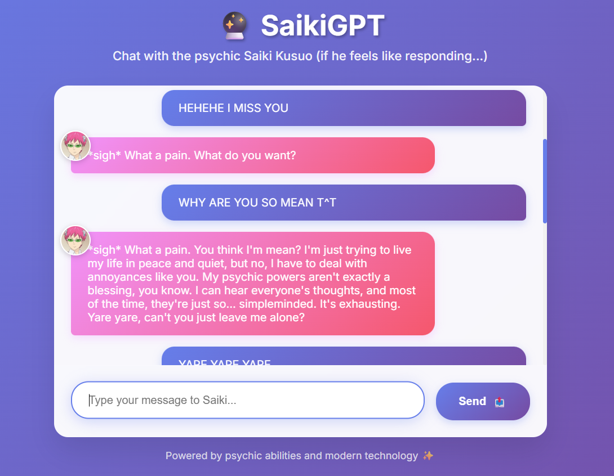

<div align="center">

# 🔮 SaikiGPT: Your Favorite Pink-Haired Psychic Bot  
*A telepathic twist on AI chatbots — featuring none other than Saiki Kusuo!*


</div>

---

## 🧠 About the Project

What if your chatbot had *psychic powers*... and also zero patience?  
**SaikiGPT** is a fun AI chatbot themed around **Saiki Kusuo**, the iconic character from *The Disastrous Life of Saiki K.* Whether you're asking about your fate, ranting about school, or just vibing — SaikiGPT responds in true Saiki fashion: psychic, sarcastic, and slightly annoyed.

> 🌸 Just for fun — built with love.  
> 🧩 Made using: Python, Flask, HTML/CSS

---

## 🧪 Live Demo

✨ [Try SaikiGPT Here (Render Link)](https://saiki-gpt.onrender.com) ✨  
_It’s like having your own anime sidekick... who can read your mind and probably doesn’t care._

---

## 🛠️ Features

- 💬 **Conversational Chatbot**: Simulates Saiki's personality and tone
- 🌐 **Cute Frontend**: Aesthetic inspired by anime + minimalist psychic vibes
- 📦 **Flask Backend**: Clean API routing and GPT-powered responses
- 🧃 **Hosted on Render**: Just click and chat with Saiki

---

## 📸 Sneak Peek

<p align="center">
  
</p>

---

## 🎯 How to Run Locally

Clone the repo and teleport into the folder:

```bash
git clone https://github.com/Mariam-Rehan/Saiki-Kusuo-Chat.git
cd saikigpt
```

Set up your environment:

```bash
pip install -r requirements.txt
```

Create a `.env` file with your OpenRouter API key:

```env
OPENROUTER_API_KEY =your-api-key-here
```

Run it:

```bash
python main.py
```

Go to `http://localhost:5000` and start chatting with your favorite psychic.

---

## 🧠 Why I Made This

IM A HUUUUGE SAIKI KUSUO FAN!! I rewatch the show like anytime I'm free and I wanted to make this because this was the only way I could motivate myself to do SOMETHING this summer. I mean how could I disappoint Saiki? A fictional character that probably could not care less about me?   

---

## 🦄 Let's Connect!

Made with love by [Mariam Rehan](https://www.linkedin.com/in/mariam-rehan)

---
